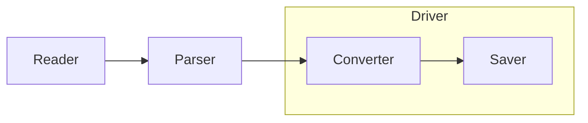

Конвертация осуществляется по следующей схеме:



Если Вы хотите сохранить сообщения в свой собственный формат, то вам необходимо написать свой драйвер:
```python
from vkparse.models import Message
from vkparse.driver import Driver


class MyDriver(Driver):
    def __init__(self) -> None:
        super().__init__()
        self._conn = connect('database')
        
    def on_message(self, msg: Message) -> None:
        self._conn.insert(msg)

    def after_all(self) -> None:
        self._conn.close()
```

Далее передайте экземпляр этого драйвера в Pipe:
```python
from vkparse.pipe import Pipe
from vkparse.parsers.bs4_parser import BS4Parser

driver = MyDriver()
# Первый аргумент - список путей до папок с диалогами
pipe = Pipe(["GDPR/messages/0"], BS4Parser(), driver)
# Начинаем обработку
pipe.process()
```
